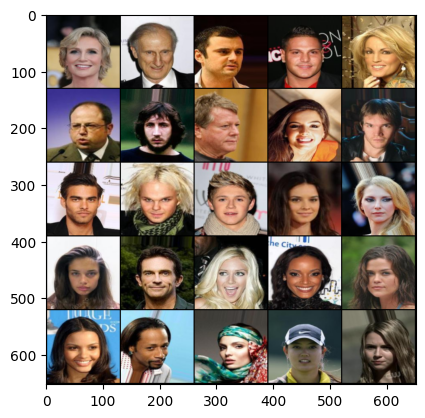
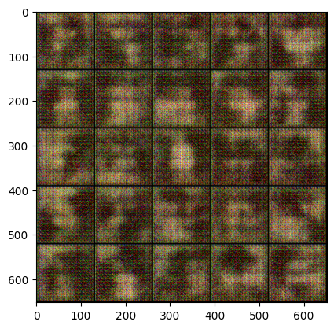
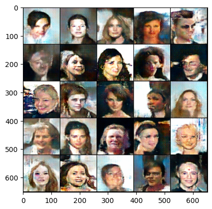
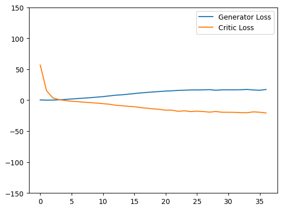
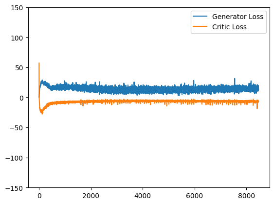

# GAN on CelebA Dataset

## Overview
This repository contains a Generative Adversarial Network (GAN) trained on the CelebA dataset to generate realistic human face images. The project leverages deep learning techniques to synthesize high-quality face images from random noise.

## Features
- Uses the CelebA dataset, which contains over 200,000 images of celebrity faces.
- Implements a Deep Convolutional GAN architecture.
- Generates high-quality and diverse human face images.
- Provides training scripts and pre-trained model checkpoints.

## Installation
```bash
# Clone the repository
git clone https://github.com/Aditya-Ranjan1234/Celeb-Face-GAN.git
cd Celeb-Face-GAN
```

## Dataset
The CelebA dataset can be downloaded from the official website: https://www.kaggle.com/datasets/jessicali9530/celeba-dataset



## Results
Generated images will be stored in the `output/` directory. Below is an example of the generated images:

<p align="center">
  
  
  <br>
  
  
</p>

